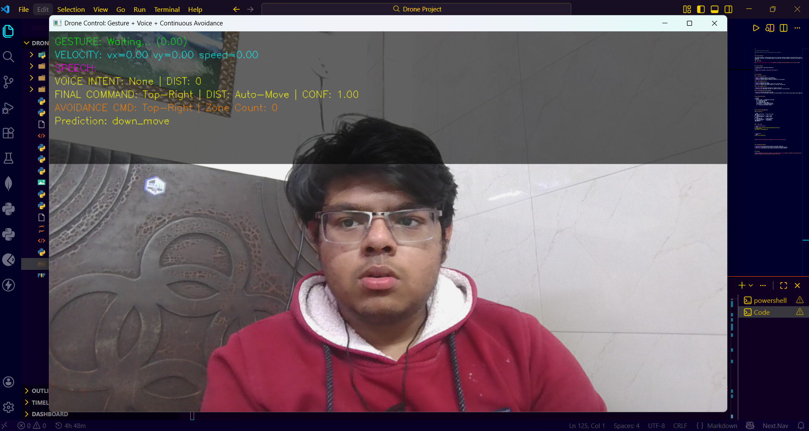
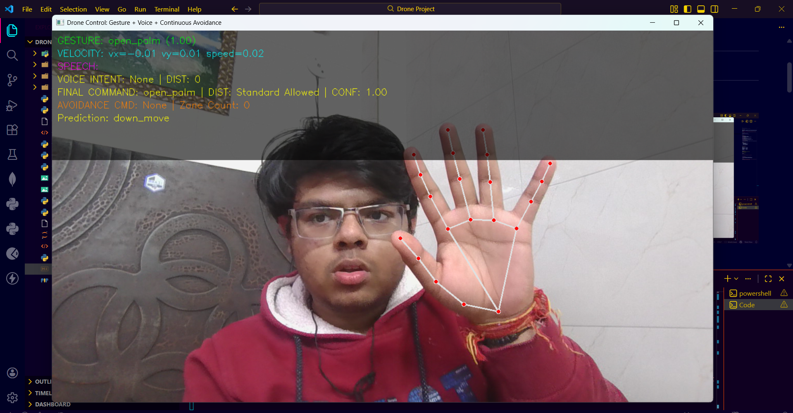
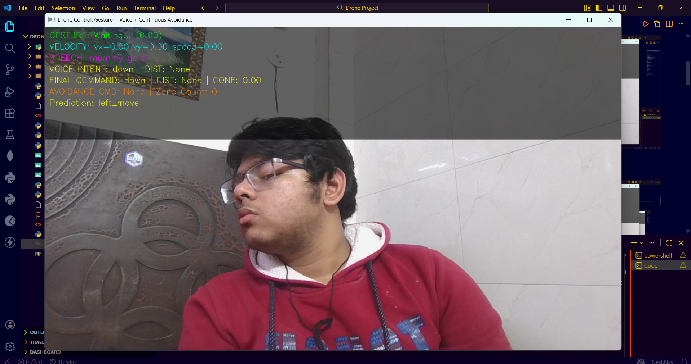
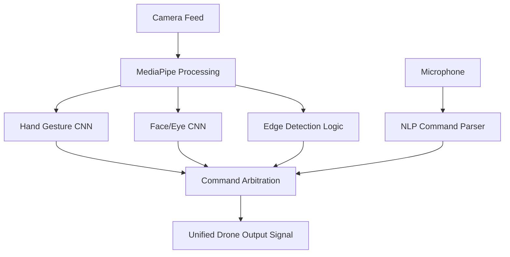

# Multimodal Drone Control System

### Hand • Face/Eye • Voice • Vision-Based Collision Awareness

---

##  Project Overview

This project presents a software-based drone control system that enables navigation using natural human inputs instead of traditional controllers. By leveraging computer vision and NLP, the system creates a unified control signal from multiple human modalities.

###  Demo Video

**[Click here to watch the full system demo](https://www.google.com/search?q=https://your-link-here.com)**

---

##  Visual Showcase

### Front Page



### Gesture Detection



### Face Detection


---

##  Core Modules

### 1. Hand Gesture Control

* **Engine:** MediaPipe Hands (21 3D landmarks).
* **Model:** CNN-based temporal sequence processing.
* **Mapping:** Dynamic gestures translate to Pitch, Roll, and Altitude.

### 2. Face Movement Control

* **Engine:** MediaPipe Face Mesh.
* **Logic:** Normalized eye landmarks reduce noise from head tilt.
* **Intent:** Predicts directional intent (e.g., Look Left  Strafe Left).

### 3. Voice Command Control

* **Engine:** Real-time Speech Recognition + Semantic Similarity.
* **Flexibility:** Understands "Go left" and "Move left slowly" as the same intent.

### 4. Vision-Based Collision Awareness

* **Logic:** Grid-based edge detection (3x3).
* **Autonomy:** If no user input is detected, the system defaults to the "safest" visual region (least edge density).

---

## 🧠 System Architecture



---

## 🏗️ Technical Implementation

### File Structure

```text
├── final_inference.py    # Main entry point
├── models/
│   ├── gesture_model.pt  # CNN for Hands
│   └── face_model.pt     # CNN for Eyes
├── data/
│   ├── labels.pkl        # Gesture mapping
│   └── face_labels.pkl   # Eye mapping
├── requirements.txt      # Dependencies
└── README.md

```

### 🚀 How to Run

1. **Clone and Install:**
```bash
git clone https://github.com/yourusername/drone-control.git
cd drone-control
pip install -r requirements.txt

```


2. **Launch:**
```bash
python final_inference.py

```


* *Note: Ensure your webcam and microphone are not in use by other apps.*


---

## 🧪 Validation & Results

* **Latency:** Real-time inference achieved on standard laptop CPU.
* **Robustness:** Validated across diverse lighting and cluttered backgrounds.
* **Accuracy:** High precision eye-tracking via normalized landmark scaling.

---

## 👤 Author

**Vinay Goyal** *Drone Software & Computer Vision Specialist* [LinkedIn](https://linkedin.com/in/yourprofile) | [Portfolio](https://www.google.com/search?q=https://yourportfolio.com)

---
